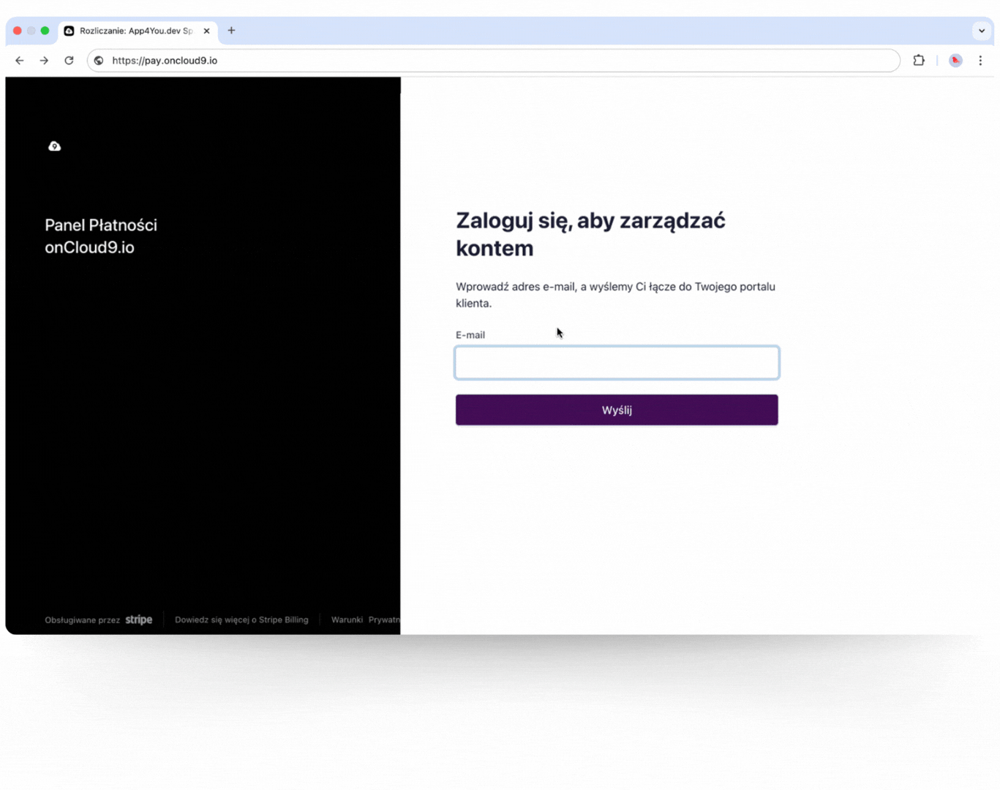

# Edycja danych do faktury

Link do udostępnienia tego artykułu: [Edycja danych do faktury](https://oncloud9.gitbook.io/docs/platnosci/edycja-danych-do-faktury)

### Jak edytować dane do faktury w onCloud9



### Logowanie do Stripe

Zaloguj się na swoje konto płatności onCloud9 z Stripe. Możesz to zrobić klikając [https://billing.stripe.com/p/login/00g3cS6HPgpOdZ6aEE](https://billing.stripe.com/p/login/00g3cS6HPgpOdZ6aEE).&#x20;

<figure><figcaption></figcaption></figure>




### Zaakceptu logowanie przez maila

Wprowadź swój adres e-mail, a my wyślemy Ci link bezpośrednio do portalu klienta.&#x20;


Link będzie aktywne przez 30 minut.




### Zlokalizowanie danych rozliczeniowych

Po zalogowaniu kliknij na "Manage Billing Details". To tutaj dokonasz wszelkich zmian w danych.



### Popraw dane

Wprowadź swoje imię i nazwisko/nazwę firmy, adres i NIP/VAT ID. Zapisz zmiany, klikając przycisk „Save”. <mark style="background-color:red;">Pamiętaj aby napisać PL przed NIP!</mark>\




### Pobieranie faktur

Po zapisaniu zmian, przejdź do sekcji "Invoices" i pobierz swoją najnowszą fakturę w formacie PDF.\




***

### Najczęściej zadawane pytania (FAQ)

Czy mogę edytować dane na już wystawionej fakturze?

Nie, zmiany dotyczą tylko przyszłych faktur. Skontaktuj się z zespołem wsparcia, jeśli potrzebujesz korekty.

Co zrobić, jeśli coś zepsuję? A Sophia nie jest w stanie mi pomóc?

Napisz na chat do Sophii i poproś o połączenie z człowiekiem. Razem naprawimy ten problem!

Czy mogę zmienić dane, jeśli nie jestem płatnikiem VAT?

Tak, pole NIP/VAT ID jest opcjonalne. Jeśli go nie masz, po prostu je pomiń.

